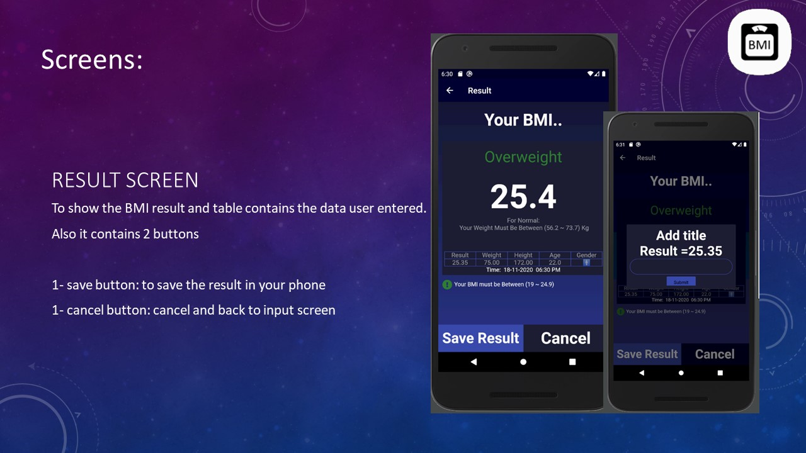

# BMI And Search For Recipes

 

  
 
  <h2 align="center"> BMI And Search For Recipes </h2>

 

 A Flutter project for calculation BMI and to search for Recipes.

---

## Sections

- [App Gif Screen](#GIF_Screens)
- [Packages And_Dependacies](#Packages_And_Dependacies)
- [App Screen](#App_Screen)

---

## GIF_Screens

    <table>
        <tr>
            <td> 
                
            </td>    
            <td>   
                
            </td>
             <td>   
                
            </td>        
        </tr>
        <tr>
            <td> 
                
            </td>    
            <td>   
                
            </td>
            <td>   
                
            </td>            
        </tr>
    </table>

---

## Packages_And_Dependacies

- font_awesome_flutter
- get
- animated_text_kit
- sqflite
- path
- intl
- http
- webview_flutter
- flutter_search_bar
- cached_network_image
- cupertino_icons
- flutter_launcher_icons:

---

## App_Screen

    <table>
        <tr>
             <td> 
                
            </td> 
            <td>   
                
            </td>          
        </tr>
        <tr>
            <td> 
                
            </td>    
                <td>   
                
            </td>      
        </tr>
        <tr>  
            <td>   
                
            </td>   
            <td> 
                
            </td>           
        </tr>
    </table>

    

